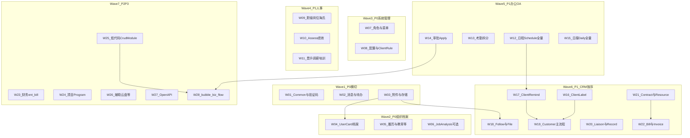

# 陀螺匠 OA 迁移执行计划：PHP Laravel 9 → Java 17 + Spring Boot 3

> **版本**: 1.0 + **v2 执行路线图**（2026-04-04）  
> **创建日期**: 2026-03-30  
> **目标**: 功能对齐，不新增能力；前端 Vue2 保持不变；**日常排期以第二节 v2 工作包为准**，第三节起为 1.0 接口字典（保留对照 PHP 明细）。  

---

## 一、项目背景与现状基线

### 1.1 源系统 (PHP)

- **框架**: Laravel 9 + Swoole (LaravelS) + JWT + Casbin
- **控制器**: ~129 个 (`app/Http/Controller/AdminApi/`)
- **服务层**: ~200+ Service + Dao
- **数据库**: MySQL，~219 张 `eb_` 前缀表
- **API 前缀**: `/api/ent/*` (Spatie 路由属性注册)
- **前端**: Vue 2.6 + Element UI 2.15，基地址 `{origin}/api/ent`

### 1.2 目标系统 (Java) — Bubble-Cloud

- **框架**: Java 17 + Spring Boot 3.5.9 + Spring Cloud 2025.0.1 + Spring Cloud Alibaba 2025.0.0.0
- **ORM**: MyBatis-Plus 3.5.16
- **认证**: Spring Authorization Server + OAuth2（OA 模块通过 `OaPhpJwtTokenService` 桥接 PHP JWT）
- **网关**: Spring Cloud Gateway (8666)
- **注册/配置中心**: Nacos

### 1.3 已完成模块

| 模块 | 状态 | Controller / Endpoint |
|------|------|----------------------|
| bubble-gateway | 已完成 | 统一入口 |
| bubble-auth | 已完成 | 2C / ~4E |
| bubble-biz-backend | 已完成 | 14C / 98E (RBAC/系统管理) |
| bubble-biz-agi | 已完成 | 14C / 84E (AI 智能体) |
| bubble-biz-oa | **迁移中** | 30C / 88E (约 40% 有真实逻辑，60% 为占位桩) |
| bubble-biz-flow | 未开始 | 仅启动类 |
| bubble-visual | 已完成 | codegen/monitor/quartz |

### 1.4 核心原则

1. **功能对齐不新增** — 只复刻 PHP 已有能力
2. **前端不动** — Vue2 + Element UI 保持原样，API 路径和响应格式完全兼容
3. **数据库不迁移** — 直连同一 MySQL 实例，实体用 `@TableName("eb_xxx")` 映射
4. **响应格式兼容** — OA 接口使用 `R.phpOk`/`R.phpFailed`（与 PHP `status`/`msg`/`data` 对齐，见 `R` 的 JSON `status`/`code`）
5. **禁止占位桩** — 每阶段实施的接口必须实现真实业务逻辑，不允许 `SimplePageVO.empty`

### 1.5 技术映射表

| PHP 技术 | Java 替代 |
|----------|----------|
| Laravel 9 | Spring Boot 3.5.9 |
| JWT (tymon) | OaPhpJwtTokenService 桥接 |
| Casbin RBAC | Spring Security + `@HasPermission` |
| Swoole/LaravelS | Undertow + WebSocket |
| Eloquent ORM | MyBatis-Plus 3.5.16 |
| Redis | Spring Data Redis |
| 队列 Jobs | Spring Quartz |
| OSS/COS/七牛 | common-oss (S3 兼容) |
| Spatie 路由属性 | `@RequestMapping` / `@GetMapping` 等 |

---

## 二、v2 执行路线图（当前排期）

> **用途**：将原「11 阶段」拆为 **7 个波次、28 个工作包（W-01～W-28）**，按 **依赖优先** 排序；与 `bubble-biz-oa` / `bubble-api-oa` 真实占位情况对齐。  
> **接口清单**：仍以本文 **第三节起** 各阶段表格为 PHP→Java 对照字典。

### 2.1 开发规范（强制）

实施与 Code Review 须遵守仓库规则 [`.cursor/rules/backend-conventions.mdc`](../../.cursor/rules/backend-conventions.mdc)，OA 相关要点如下：

- **分层**：`XxxService extends UpService`、`XxxServiceImpl extends UpServiceImpl`、`XxxMapper extends UpMapper`；自定义 SQL 写在 `bubble-biz-oa/.../mapper/XxxMapper.xml`，Mapper 接口上禁止 `@Select`/`@Update` 等（BaseMapper 无 XML 的 CRUD 除外）。
- **对外返回**：OA 接口统一 `R.phpOk` / `R.phpFailed`，勿与网关 `R.ok` 混用。
- **Controller**：禁止注入 Mapper、禁止在 Controller 内写 `Wrappers.lambdaQuery`；复杂条件查询在 ServiceImpl + XML。
- **类型**：禁止业务层 `Map<String, Object>` 作入参/出参/Mapper 行；用 `bubble-api-oa` 的 DTO/VO/实体或 `JsonNode` 等规范例外。
- **占位**：禁止新增 `SimplePageVO.empty` 类占位桩；每工作包交付时应消掉本包范围内的空分页/空列表桩。
- **事务**：`ServiceImpl` 对 `create`/`update` 重写并 `@Transactional(rollbackFor = Exception.class)` 后调 `super.create`/`super.update`。
- **验收第一原则**：与 **PHP 同路径、同参数、同响应结构** 对齐，用 Java 复刻能力，不擅自增删前端契约字段。

### 2.2 相对 1.0 文档的代码状态勘误

以下条目修正 **第三节各表「Java 状态」列可能已过期** 的判断；实施前以代码为准。

| 类别 | 说明 |
|------|------|
| **已实现或已优于 1.0 描述** | `LoginController`：`register`、`phone_login`、`scan_key`/`scan_status` 等已接入；`CommonController`：部分短信 `verify`/`verify/key`、`message` 已接；`EnterpriseUserController`：`PUT /card/{id}` 等已接；工作台 `EnterpriseUserDailyController`：`/daily`、`/pending` 等已接；`UserMemorialController`：备忘录 CRUD；CRM 多控制器已落地（见阶段 5 之 §7.4）。 |
| **`SimplePageVO.empty` 等显式占位** | `ScheduleController` `GET /page`；`UserCenterController` 简历分页；`CloudController`、`FinanceController`、`ModuleController`、`ProgramController`、`ReportController` 等模块级占位入口。迭代内应逐项替换为真实 `findPg`/业务 VO。（员工档案已由 `CompanyCardController` `POST /ent/company/card` 承接，已移除 `EnterpriseController` `GET /user-card/page`。） |
| **考勤** | `AttendanceGroupController`、`CalendarConfigController` 已有实现；`AttendanceController` 当前多为空列表桩；PHP 侧统计/打卡/班次/排班/周期等需在 Java 侧 **按控制器维度补全**（见 W-13）。 |
| **审批** | `ApproveConfig` / `ApproveHolidayType` / `ApproveReply` 已有；**`ent/approve/apply`（审批申请与流转主流程）在 Java 侧缺对等 Controller**，见 W-14。 |
| **日报** | `DailyController` 等仅部分桩（如 `report_member` 空列表），与 PHP `ent/daily` 全量差距大，见 W-15。 |
| **路径别名** | `UserController` 使用 `GET/PUT /account_info` 对应 PHP 个人资料时，与文档中的 `/userInfo` 命名可能不一致，以 **前端实际请求路径** 与 PHP 路由为准做回归，避免重复注册同路径。 |

### 2.3 排期规则（优先级）

- **依赖优先**：列表/详情要联查的能力（**标签、提醒、附件、日程**）先于主实体大列表。
- **横切先于垂直**：Common / 附件 / 消息先于 CRM、档案导入。
- **同一前端页**：按 PHP 调用顺序（先下拉选项，再保存主表）。
- **占位清零**：每迭代结束扫描 `SimplePageVO.empty` 与无业务含义的 `Collections.emptyList()` 桩。

### 2.4 波次总览

| 波次 | 名称 | 优先级 | 工作包 | 主要依赖 |
|------|------|--------|--------|----------|
| Wave 1 | 横切底座 | P0 | W-01～W-03 | 无 |
| Wave 2 | 组织与档案 | P0 | W-04～W-06 | W-03 利于导入类能力 |
| Wave 3 | 系统管理 | P0 | W-07～W-08 | Wave 1 |
| Wave 4 | 人事查漏补缺 | P1 | W-09～W-11 | Wave 2～3 |
| Wave 5 | OA 办公 | P1 | W-12～W-15 | 组织/用户数据一致 |
| Wave 6 | CRM（严格顺序） | P1 | W-16～W-22 | W-03、W-12；**标签→提醒→跟进/文件→客户→…** |
| Wave 7 | 财务/项目/低代码/开放/Flow | P2～P3 | W-23～W-28 | CRM/日程/审批等主链稳定后 |

### 2.5 依赖关系（示意）

### 2.6 工作包明细（W-01～W-28）

#### Wave 1 — P0 横切底座

- **W-01 Common 与验证码**  
  - [ ] 对齐 PHP `ent/common` 仍缺项（上传/下载、`initData`、城市、问卷、发票回调等，见第三节 3.2.2）。  
  - [ ] 评估 `captcha`、`auth` 是否仍为占位语义，按 PHP 真值实现。  
  - **主要代码**：`CommonController`、`CommonService` / `CommonServiceImpl`。

- **W-02 消息与待办一致性**  
  - [x] `common/message` 与 PHP `NoticeRecordService::getMessageList` 对齐：默认 `is_read=0`、`buttons`、模板 `url/uni_url`、`messageNum` 同条件计数；列表蛇形字段。`UserPending` / 工作台 `pending` 仍为独立表（与 PHP 一致），未合并数据源。  
  - [x] 后台 `ent/system/message/list` 返回 `list`+`count` 及 `message_template`/`system_template` 等；新增 `GET /cate`（分类 + 未读数）。`find/{id}` 仍为实体直出（PHP 含模板拆分，可后续 W 再补）。  
  - **主要代码**：`MessageController`、`MessageService`/`MessageServiceImpl`、`EnterpriseMessageNoticeServiceImpl`、`MessageCategory`；工作台 `EnterpriseUserDailyService` 未改。

- **W-03 附件与云存储**  
  - [x] `SystemStorage` / `SystemAttach` 与 CRM 文件、导入模板、员工档案导入共用能力验收（本地上传根目录 `OaLocalUploadSupport` + `upload_type`；`ent/system/attach/*` 与 PHP 路由对齐；附件分类树 + CRUD；云存储列表/凭证写入 `eb_system_config`/软删与 PHP 语义一致；非本地存储上传返回明确错误）。  
  - **主要代码**：`SystemStorageController`、`SystemAttachController`、`AttachCateAdminController`。

#### Wave 2 — P0 组织与档案

- **W-04 员工档案 UserCard**  
  - [x] 实现 PHP `ent/company/card` 全量接口，**替换** `EnterpriseController` 的 `GET /user-card/page` 占位（`CompanyCardController` + `CompanyCardServiceImpl`）。  
  - **主要代码**：新建或扩展 `UserCard` 相关 Controller/Service（路径以 PHP 为准）。

- **W-05 个人与企业履历线**  
  - [x] 第三节 3.2.8：工作经历、教育、任职、备忘录分类、企业侧履历等 Resource；与 `UserMemorialController` 路径分工清晰。  
  - **主要代码**：按 PHP 前缀新增/补全 Controller + `bubble-api-oa` 实体/DTO。

- **W-06 JobAnalysis（可选并行）**  
  - [x] `ent/company/job_analysis` 与 PHP 对齐（`JobAnalysisController` + `JobAnalysisServiceImpl` + `eb_enterprise_user_job_analysis`）。

#### Wave 3 — P0 系统管理

- **W-07 角色与菜单**  
  - [ ] `EnterpriseRoleController` / `SystemMenusController` 相对 PHP `ent/system/roles`、`ent/system/menus` 的 CRUD 与扩展接口闭集（成员、密码等）。

- **W-08 其余配置与 ClientRule**  
  - [ ] Dict/Form/Quick/Agreement/Log/Upgrade 等与第四节对照，标已实现/缺口。  
  - [ ] `ClientRuleController` 与 PHP 行为一致。

#### Wave 4 — P1 人事（查漏补缺）

- **W-09 职级 / 岗位 / 海氏**  
  - [ ] `RankCategoryController`、`RankController`、`RankJobController`、`RankLevelController`、`HayGroupController` 与 PHP Service 字段级 diff 关闭。

- **W-10 绩效 Assess**  
  - [ ] `AssessController` 及关联 Plan/Target/Template 等与 PHP 21+ 接口返回形状与分支对齐。

- **W-11 晋升 / 调薪 / 培训**  
  - [ ] `PromotionController`、`PromotionDataController`、`EnterpriseUserSalaryController`、`EmployeeTrainController` 等与 PHP 对齐（在已有 Controller 上补业务）。

#### Wave 5 — P1 OA 办公

- **W-12 日程 Schedule 全量**  
  - [ ] 去掉 `ScheduleController` 分页桩；补齐 PHP `ent/schedule` 缺失接口（类型 CRUD、日程 CRUD、评价等，见第六节 6.2）。  
  - **依赖说明**：**W-17 客户提醒与日程联动** 依赖本包完成。

- **W-13 考勤拆分实现**  
  - [ ] 按 PHP 七个考勤相关控制器维度在 Java 侧增补 Controller/Service（统计、打卡、班次、排班、周期等），与现有 `AttendanceGroup`、`CalendarConfig` 衔接。  
  - [ ] 消除 `AttendanceController` 仅空列表问题；处理 `AttendanceGroupServiceImpl` 中 RosterCycle 等待办。

- **W-14 审批 Apply**  
  - [ ] **新增** `ApproveApplyController`，路径对齐 `ent/approve/apply`（处理、撤销、导出、催办、加签、转审等）。  
  - [ ] 与 **W-28** 衔接策略：**先 PHP 等价直实现**，再迁 Flowable/Camunda（见第十三节）。

- **W-15 日报 Daily 全量**  
  - [ ] 以 `DailyController`、`ReportController`（或合并策略以 PHP 为准）对齐 `ent/daily` 全量；依赖组织架构与员工档案数据一致。

#### Wave 6 — P1 CRM（**严格顺序：标签 → 提醒（联动日程）→ 跟进/文件 → 客户 → 联系人/记录 → 合同 → 账单/发票**）

- **W-16 ClientLabel（最先）**  
  - [ ] 标签 CRUD + 与客户列表筛选、客户保存时标签关联，与 PHP 一致。  
  - **主要代码**：`CrmClientLabelController` 及 Service/Mapper。

- **W-17 ClientRemind**  
  - [ ] 提醒全量；**与日程（W-12）联动**（对齐 §7.4）。  
  - **主要代码**：`CrmClientRemindController`。

- **W-18 ClientFollow + ClientFile**  
  - [ ] 跟进与文件；**文件依赖 W-03 附件体系**。  
  - **主要代码**：`CrmClientFollowController`、`CrmClientFileController`。

- **W-19 Customer 主流程**  
  - [ ] 列表/详情/流转/统计/标签/业务员/导入等在 **W-16、W-18** 完成后做字段级回归。  
  - **主要代码**：`CrmCustomerController`。

- **W-20 Liaison + Record**  
  - [ ] `CrmCustomerLiaisonController`、`CrmCustomerRecordController` 与 PHP 对齐。

- **W-21 Contract + Resource**  
  - [ ] `CrmContractController`、`CrmContractResourceController` 与 PHP 对齐。

- **W-22 Bill + Invoice**  
  - [ ] `CrmClientBillController`、`CrmClientInvoiceController`；在线开票 URI 等占位按 §7.4 关闭或对接网关；**依赖 W-21**。

#### Wave 7 — P2 / P3 与 Flow

- **W-23 财务 `ent/bill`**  
  - [ ] 替换 `FinanceController` 占位；可与 CRM 账单联动验证。

- **W-24 项目 Program**  
  - [ ] 替换 `ProgramController` 等占位（见第九节）。

- **W-25 低代码 Crud / Module**  
  - [ ] 替换 `ModuleController` 占位；按第十节拆子能力（表、字段、触发器、视图、dashboard、curl、approve）。

- **W-26 辅助能力**  
  - [ ] 云盘 `CloudController`、公告、物资、帮助、Chat 与 AGI 边界（见第十一节）。

- **W-27 Open API**  
  - [ ] 对齐第十二节；依赖 CRM、日程、低代码等主数据稳定。

- **W-28 bubble-biz-flow**  
  - [ ] 与 W-14、W-25 审批链路对接（见第十三节）。

### 2.7 工作包验收建议（每个 W-XX）

- PHP 与 Java 同路径抽样请求对比（路径、关键字段、HTTP 状态与 `data` 形状）。  
- 列出本次变更的 `bubble-api-oa` DTO/VO/实体。  
- 复杂 SQL 注明 `XxxMapper.xml` 与 PHP 原 Service/SQL 对照点。

### 2.8 归档：1.0 十一阶段粗粒度总览

> 以下为 **v1.0** 阶段划分，**仅作粗粒度参考**；执行顺序以 **2.4～2.6** 工作包为准。

| 阶段 | 名称 | 优先级 | PHP 控制器数 | 预估工时 | 前置依赖 |
|------|------|--------|-------------|---------|---------|
| 1 | 核心用户与组织管理 | P0 | 18 | 2-3 周 | 无 |
| 2 | 配置中心与系统管理 | P0 | 17 | 1.5-2 周 | 阶段 1 |
| 3 | HR/人事管理 | P1 | 15 | 2-3 周 | 阶段 1, 2 |
| 4 | OA 办公 (考勤/审批/日程/日报) | P1 | 15 | 3-4 周 | 阶段 1, 2 |
| 5 | CRM 客户管理 | P1 | 16 | 3-4 周 | 阶段 1, 2 |
| 6 | 财务管理 | P2 | 3 | 1-1.5 周 | 阶段 5 |
| 7 | 项目管理 | P2 | 6 | 2 周 | 阶段 1 |
| 8 | 低代码平台 | P2 | 6 | 3-4 周 | 阶段 2, 11 |
| 9 | 辅助功能模块 | P3 | 16 | 2-3 周 | 阶段 1, 2 |
| 10 | 开放 API | P3 | 10 | 1.5-2 周 | 阶段 5, 8 |
| 11 | 工作流引擎 | P2 | - | 2-3 周 | 阶段 4 |
| **合计** | | | **~122** | **~24-33 周** | |

---

## 三、阶段 1：核心用户与组织管理 (P0)

> **说明**：本节起为 **1.0 PHP→Java 接口字典**；任务优先级、依赖与占位消桩顺序以 **第二节 v2** 为准。表格中「Java 状态」可能早于当前代码，实施前结合 **§2.2 勘误** 与仓库代码核对。

### 3.1 目标与验收标准

前端能完成：登录 → 获取菜单 → 显示工作台 → 查看/编辑用户信息 → 组织架构管理 → 通讯录 → 个人简历/经历管理 → 员工档案管理

### 3.2 PHP→Java 控制器对照与接口清单

#### 3.2.1 LoginController → LoginController (已有，需补全)

**PHP Prefix**: `ent/user` | **Java**: `@RequestMapping("/ent/user")`

| HTTP | Path | 方法 | 说明 | Java 状态 |
|------|------|------|------|----------|
| POST | /login | login | 账号密码登录 | 已实现 |
| POST | /register | register | 用户注册 | 返回"尚未实现"，需补全 |
| POST | /phone_login | phone_login | 短信验证码登录 | 返回"尚未实现"，需补全 |
| GET | /info | info | 获取用户信息 | 已实现 |
| GET | /logout | logout | 退出登录 | 已实现(返回 true) |
| PUT | /savePassword | savePassword | 修改密码 | 已实现 |
| PUT | /save_pwd | password | 修改密码(别名) | 已实现 |
| PUT | /common/savePassword | savePassword | 修改密码(别名) | 已实现 |
| GET | /scan_key | getScanCode | 获取扫码登录二维码 | 返回"尚未实现"，需补全 |
| POST | /scan_status | scanKeyStatus | 获取扫码状态 | 返回"尚未实现"，需补全 |

#### 3.2.2 CommonController → CommonController (已有，需补全)

**PHP Prefix**: `ent/common` | **Java**: `@RequestMapping("/ent/common")`

| HTTP | Path | 方法 | 说明 | Java 状态 |
|------|------|------|------|----------|
| GET | /config | getConfig | 获取网站配置 | 已实现 |
| GET | /site | siteConfig | 站点配置 | 已实现 |
| GET | /captcha | captcha | 获取验证码 | 占位，需实现 |
| GET | /aj_captcha | ajcaptcha | 获取图形验证码 | 缺失，需新增 |
| POST | /ajcheck | ajcheck | 验证码一次验证 | 缺失，需新增 |
| POST | /verify | verify | 验证码短信发送 | 缺失，需新增 |
| GET | /verify/key | verifyCode | 获取短信发送 key | 缺失，需新增 |
| GET | /message | message | 获取消息列表 | 占位，需实现 |
| PUT | /message/{id}/{isRead} | updateMessage | 修改消息状态 | 缺失，需新增 |
| GET | /auth | auth | 获取授权信息 | 占位，需实现 |
| GET | /version | getVersion | 获取版本信息 | 缺失，需新增 |
| GET | /upload_key | getTempKeys | 获取上传 token | 缺失，需新增 |
| POST | /upload | upload | 上传文件 | 缺失，需新增 |
| GET | /download_url | getDownloadUrl | 获取下载地址 | 缺失，需新增 |
| ANY | /download | download | 下载文件 | 缺失，需新增 |
| GET | /logout | logout | 退出登录 | 缺失，需新增 |
| POST | /initData | initData | 获取默认数据路径 | 缺失，需新增 |
| GET | /site_address | getSiteAddress | 获取网址 | 缺失，需新增 |
| GET | /city | city | 查找城市数据 | 缺失，需新增 |
| ANY | /invoice/call_back | invoiceCallBack | 发票回调 | 缺失，需新增 |
| GET | /q/{unique} | questionnaire | 问卷调查中转 | 缺失，需新增 |
| GET | /questionnaire_info/{unique} | getQuestionnaireInfo | 获取问卷表单 | 缺失，需新增 |
| POST | /questionnaire_save/{name}/{unique} | saveQuestionnaire | 问卷表单保存 | 缺失，需新增 |

#### 3.2.3 UserController → UserController (已有，需补全)

**PHP Prefix**: `ent/user` | **Java**: `@RequestMapping("/ent/user")`

| HTTP | Path | 方法 | 说明 | Java 状态 |
|------|------|------|------|----------|
| GET | /menus | menus | 获取当前用户菜单 | 已实现 |
| GET | /userInfo | userInfo | 获取当前用户信息 | 缺失，需新增 |
| PUT | /userInfo | update | 修改当前用户信息 | 缺失，需新增 |
| POST | /checkpwd | checkPwd | 验证密码规范 | 缺失，需新增 |
| GET | /resume | resume | 获取个人简历 | 缺失，需新增 |
| PUT | /resume_save | resumeSave | 保存个人简历 | 缺失，需新增 |

#### 3.2.4 WorkController → WorkbenchController (已有，需补全)

**PHP Prefix**: `ent/user/work` | **Java**: `@RequestMapping("/ent/user/work")`

| HTTP | Path | 方法 | 说明 | Java 状态 |
|------|------|------|------|----------|
| GET | /menus | getFastEntry | 获取工作台快捷入口 | 已实现 |
| POST | /menus | setFastEntry | 保存工作台快捷入口 | 已实现 |
| GET | /count | indexCount | 获取工作台待办数量 | 已实现 |
| GET | /daily | daily | 获取某月计划列表 | 缺失，需新增 |
| GET | /pending | pending | 获取待办列表 | 缺失，需新增 |
| GET | /statistics_type | statisticsType | 获取业绩统计类型 | 已实现 |
| POST | /statistics_type | updateStatisticsType | 修改业绩统计类型 | 已实现 |
| GET | /statistics/{types} | statistics | 工作台业绩统计 | 已实现 |

#### 3.2.5 CompanyUserController → CompanyUserController (已有，需补全)

**PHP Prefix**: `ent/user` | **Java**: `@RequestMapping("/ent/user")`

| HTTP | Path | 方法 | 说明 | Java 状态 |
|------|------|------|------|----------|
| GET | /list | index | 组织架构人员列表 | 已实现 |
| GET | /card/{id} | editUser | 组织架构成员信息 | 已实现 |
| PUT | /card/{id} | updateUser | 修改组织架构成员 | 缺失，需新增 |
| GET | /add_book/tree | getFrameTree | 通讯录 tree 型数据 | 已实现 |
| GET | /add_book/list | addressBook | 通讯录用户列表 | 已实现 |

#### 3.2.6 CompanyController → CompanyController (已有，需补全)

**PHP Prefix**: `ent/company` | **Java**: `@RequestMapping("/ent/company")`

| HTTP | Path | 方法 | 说明 | Java 状态 |
|------|------|------|------|----------|
| GET | /info | entInfo | 当前企业详情 | 已实现 |
| PUT | /info | updateEnt | 修改当前企业详情 | 已实现 |
| GET | /quantity/{type} | quantity | 获取统计数量 | 已实现 |

#### 3.2.7 FrameController → FrameController (已有，较完整)

**PHP Prefix**: `ent/config/frame` | **Java**: `@RequestMapping("/ent/config/frame")`

| HTTP | Path | 方法 | 说明 | Java 状态 |
|------|------|------|------|----------|
| GET | / | index | 获取组织结构列表 | 已实现 |
| GET | /create | create | 获取组织结构创建表单 | 已实现 |
| POST | / | store | 保存组织结构 | 已实现 |
| GET | /{id}/edit | edit | 获取修改组织结构表单 | 已实现 |
| PUT | /{id} | update | 修改组织结构 | 已实现 |
| DELETE | /{id} | destroy | 删除组织结构 | 已实现 |
| GET | /tree | getTreeFrame | 获取 tree 型组织架构 | 已实现 |
| GET | /user | getTreeUser | 组织架构 tree 型人员 | 已实现 |
| GET | /users/{frameId} | getFrameUser | 获取部门人员列表 | 已实现 |
| GET | /scope | scopeFrames | 获取管理范围部门 | 已实现 |

#### 3.2.8 新增控制器

**UserWorkHistoryController** — `ent/user/work` (Resource CRUD，个人工作经历)
| HTTP | Path | 方法 | 说明 |
|------|------|------|------|
| GET | / | index | 获取个人工作经历列表 |
| GET | /create | create | 获取创建表单 |
| POST | / | store | 保存工作经历 |
| GET | /{id}/edit | edit | 修改表单 |
| PUT | /{id} | update | 修改工作经历 |
| DELETE | /{id} | destroy | 删除工作经历 |

**UserEducationHistoryController** — `ent/user/education` (Resource CRUD，个人教育经历)
- 同上 6 个 CRUD 接口

**UserMemorialCategoryController** — `ent/user/memorial_cate` (Resource CRUD，备忘录分类)
- 同上 6 个 CRUD 接口 + `GET /create/{pid}` 创建子分类

**CompanyEducationController** — `ent/education` (Resource CRUD，教育经历管理)
- 标准 6 个 CRUD 接口

**CompanyPositionController** — `ent/position` (Resource CRUD，任职经历管理)
- 标准 6 个 CRUD 接口

**CompanyWorkController** — `ent/work` (Resource CRUD，工作经历管理)
- 标准 6 个 CRUD 接口

**CompanyPerfectController** — `ent/user/perfect`
| HTTP | Path | 方法 | 说明 |
|------|------|------|------|
| GET | /index | list | 邀请记录列表 |
| PUT | /agree/{id} | agree | 同意发送个人资料 |
| PUT | /refuse/{id} | refuse | 拒绝发送个人资料 |

**UserCardController** — `ent/company/card` (员工档案核心，17 个接口)
| HTTP | Path | 方法 | 说明 |
|------|------|------|------|
| POST | / | index | 企业成员列表 |
| GET | /import/temp | importTemplate | 获取导入模板 |
| GET | /tree | frameTree | 组织架构 tree 型数据 |
| POST | /save/{type} | save | 创建保存员工档案 |
| POST | /import | import | 导入用户档案 |
| GET | /info/{id} | edit | 获取企业用户名片 |
| PUT | /{id} | update | 修改保存员工档案 |
| POST | /entry/{id} | entry | 员工入职 |
| GET | /formal/{id} | formal | 员工转正表单 |
| PUT | /be_formal/{id} | beFormal | 员工转正 |
| POST | /quit/{id} | quit | 员工离职 |
| GET | /change | cardChange | 人事异动列表 |
| DELETE | /{id} | destroy | 删除档案 |
| DELETE | /batch | batchDestroy | 批量删除档案 |
| POST | /batch | batchSetFrame | 批量设置部门 |
| GET | /perfect/{id} | sendPerfect | 邀请完善信息 |
| GET | /interview | sendInterview | 邀请面试 |

**JobAnalysisController** — `ent/company/job_analysis`
| HTTP | Path | 方法 | 说明 |
|------|------|------|------|
| GET | / | index | 工作分析列表 |
| GET | /info/{id} | info | 工作分析详情 |
| GET | /mine | mine | 我的工作分析 |
| PUT | /{id} | update | 修改工作分析 |

### 3.3 新增实体清单 (预估)

| 表名 | 实体类名 | 说明 |
|------|---------|------|
| eb_admin_info | AdminInfo | 用户详细信息 |
| eb_enterprise_user_work | EnterpriseUserWork | 工作经历 |
| eb_enterprise_user_education | EnterpriseUserEducation | 教育经历 |
| eb_enterprise_user_position | EnterpriseUserPosition | 任职经历 |
| eb_user_card_perfect | UserCardPerfect | 档案完善记录 |
| eb_user_enterprise_apply | UserEnterpriseApply | 企业申请(已有) |
| eb_user_memorial_cate | UserMemorialCategory | 备忘录分类 |
| eb_city | City | 城市数据 |

---

## 四、阶段 2：配置中心与系统管理 (P0)

### 4.1 目标与验收标准

前端系统管理模块完整可用：菜单 CRUD、角色 CRUD 含权限绑定、字典管理、表单配置、快捷入口管理、云存储配置、附件管理、消息系统、协议管理、日志查看

### 4.2 PHP→Java 控制器对照与接口清单

#### SysremConfigController → ConfigAdminController (新增)

**PHP Prefix**: `ent/config`

| HTTP | Path | 方法 | 说明 |
|------|------|------|------|
| GET | /work_bench | getWorkBenchFrom | 获取企业工作台配置 |
| POST | /work_bench | saveWorkBenchFrom | 保存企业工作台配置 |
| GET | /data/updateConfig | updateConfig | 修改配置获取表单 |
| PUT | /data/all/{cate_id} | updateAll | 修改系统配置 |
| GET | /data/firewall | firewallConfig | 获取防火墙配置 |
| PUT | /data/firewall | saveFirewallConfig | 保存防火墙配置 |

#### ConfigCateController → (合并到 ConfigAdminController)

| HTTP | Path | 方法 | 说明 |
|------|------|------|------|
| GET | /cate | index | 配置分类列表 |

#### DictTypeController → DictTypeController (已有，需补全)

**PHP Prefix**: `ent/config/dict_type` — Resource CRUD (7 接口) + `GET /info/{id}` 详情

#### DictDataController → DictDataController (新增)

**PHP Prefix**: `ent/config/dict_data` — Resource CRUD (7 接口) + `POST /tree` 树形结构

#### FormController → FormController (新增)

**PHP Prefix**: `ent/config/form`

| HTTP | Path | 方法 | 说明 |
|------|------|------|------|
| GET | /cate | index | 自定义表单列表 |
| POST | /cate | store | 保存表单分组 |
| GET | /cate/{id} | show | 修改表单分组状态 |
| PUT | /cate/{id} | update | 修改表单分组 |
| DELETE | /cate/{id} | destroy | 删除表单分组 |
| POST | /data/{types} | storeData | 保存表单 |
| PUT | /data/move/{types} | move | 移动分组 |
| GET | /data/fields/{customType} | getSalesmanCustom | 获取业务数据字段 |
| PUT | /data/fields/{customType} | saveSalesmanCustom | 保存业务数据字段 |

#### QuickCateController → QuickCateController (新增)

**PHP Prefix**: `ent/config/quickCate` — Resource CRUD (6 接口，except show)

#### QuickController → QuickController (新增)

**PHP Prefix**: `ent/config/quick` — Resource CRUD (7 接口)

#### SystemStorageController → SystemStorageController (新增)

**PHP Prefix**: `ent/config/storage` — 14 个接口 (云存储列表/创建/配置/同步/状态/域名等)

#### ClientRuleController → ClientRuleController (新增)

**PHP Prefix**: `ent/config/client_rule` — 5 个接口 (分类列表/获取配置/审批规则读写)

#### MenuController → MenusAdminController (已有，需补全为完整 CRUD)

**PHP Prefix**: `ent/system/menus` — Resource CRUD (7 接口) + `POST /not_save` 获取未保存权限

#### RoleController → RolesAdminController (已有，需大幅补全)

**PHP Prefix**: `ent/system/roles` — Resource (6 接口，except destroy) + 8 个额外接口:
- `DELETE /{id}` 删除角色
- `GET /user/{id}` 获取角色用户列表
- `GET /role/{uid}` 获取用户角色列表
- `POST /user` 修改用户角色
- `POST /add_user` 角色新增用户
- `POST /show_user` 修改角色成员状态
- `DELETE /del_user` 删除角色成员
- `POST /pwd` 修改用户密码

#### AgreementController → AgreementController (新增)

**PHP Prefix**: `ent/system/treaty` — 3 个接口 (列表/详情/修改)

#### LogController → LogController (新增)

**PHP Prefix**: `ent/system/log` — `GET /` 系统日志列表

#### UpgradeController → UpgradeController (新增)

**PHP Prefix**: `ent/system/upgrade` — 7 个接口 (状态/协议/列表/key/开始升级/进度/日志)

#### MessageController → MessageAdminController (新增)

**PHP Prefix**: `ent/system/message` — 7 个接口 (列表/分类/详情/修改/状态/订阅/同步)

#### AttachController → AttachController (新增)

**PHP Prefix**: `ent/system/attach` — 13 个接口 (列表/新建/删除/上传/移动分类/修改名称/文件上传/封面等)

#### AttachCateController → AttachCateController (新增)

**PHP Prefix**: `ent/system/attach_cate` — Resource CRUD (6 接口，except show)

### 4.3 新增实体清单 (预估)

| 表名 | 实体类名 |
|------|---------|
| eb_dict_data | DictData |
| eb_form_cate | FormCategory |
| eb_form_data | FormData |
| eb_system_quick | SystemQuick |
| eb_user_quick | UserQuick |
| eb_quick_cate | QuickCategory |
| eb_agreement | Agreement |
| eb_system_storage | SystemStorage |
| eb_system_attach | SystemAttach |
| eb_system_attach_cate | SystemAttachCategory |
| eb_client_rule | ClientRule |
| eb_rules | Rules (Casbin 权限) |

---

## 五、阶段 3：HR/人事管理 (P1)

### 5.1 目标与验收标准

前端人事模块完整可用：职级体系管理、岗位管理、海氏评估、晋升管理、调薪管理、培训管理、绩效考核全流程 (方案/计划/模板/指标/自评/上级评/审核评/申诉/统计)

### 5.2 PHP→Java 控制器对照与接口清单

#### PositionCateController → RankCateController (新增)

**PHP Prefix**: `ent/rank_cate` — Resource CRUD (6 接口，except show)

#### PositionController → RankController (新增)

**PHP Prefix**: `ent/rank` — Resource CRUD (7 接口)

#### PositionJobController → JobController (新增)

**PHP Prefix**: `ent/jobs` — Resource (6 接口，except show) + 5 个额外接口:
- `PUT /show/{id}/{status}` 修改岗位状态
- `GET /select` 岗位下拉列表
- `GET /subordinate` 下级岗位职责
- `GET /subordinate/{id}` 获取下级职责详情
- `PUT /subordinate/{id}` 修改下级职责

#### PositionLevelController → RankLevelController (新增)

**PHP Prefix**: `ent/rank_level` — Resource (4 接口) + 4 个额外接口:
- `PUT /batch/{batch}` 批量修改职位等级
- `PUT /relation/{id}` 修改职位等级关联职级
- `DELETE /relation/{id}` 删除关联职级
- `GET /rank/{cate_id}` 获取未关联职级

#### HayGroupController → HayGroupController (新增)

**PHP Prefix**: `ent/company/evaluate` — Resource (4 接口) + 2 个额外接口:
- `GET /data/{group_id}` 评估表数据列表
- `GET /history/{group_id}` 评估表历史记录

#### PromotionController → PromotionController (已有，较完整)

**PHP Prefix**: `ent/company/promotions` — Resource (5 接口)

#### PromotionDataController → PromotionDataController (新增)

**PHP Prefix**: `ent/company/promotion/data` — Resource (4 接口) + 2 个额外接口:
- `POST /standard/{id}` 标准修改
- `POST /sort/{pid}` 排序

#### CompanySalaryController → CompanySalaryController (已有，较完整)

**PHP Prefix**: `ent/company/salary` — Resource (5 接口) + `GET /last/{card_id}` 最近记录

#### EmployeeTrainController → EmployeeTrainController (已有，较完整)

**PHP Prefix**: `ent/company/train` — 2 个接口 (读/改)

#### AssessController → AssessController (新增，复杂度高)

**PHP Prefix**: `ent/assess` — 21 个接口:

| HTTP | Path | 方法 | 说明 |
|------|------|------|------|
| GET | /index | index | 获取绩效考核列表 |
| GET | /list | list | 人事绩效考核列表 |
| GET | /info/{id} | info | 获取绩效考核详情 |
| POST | /create | create | 创建绩效考核 |
| POST | /target | create | 创建绩效考核模板 |
| POST | /update/{id} | update | 修改绩效考核 |
| PUT | /self_eval/{id} | selfEval | 绩效考核自评 |
| PUT | /superior_eval/{id} | superiorEval | 上级评价 |
| PUT | /examine_eval/{id} | examineEval | 上上级审核 |
| GET | /show/{id} | show | 启用绩效考核 |
| GET | /explain/{id} | explain | 获取绩效其他信息 |
| POST | /census | census | 考核统计图 |
| POST | /census_bar | censusBar | 人事考核统计图 |
| PUT | /eval | evalTarget | 绩效指标自评 |
| GET | /score/{id} | record | 绩效评分记录 |
| GET | /del_form/{id} | deleteForm | 绩效删除表单 |
| DELETE | /delete/{id} | delete | 绩效删除 |
| GET | /del_record | deleteRecord | 绩效删除记录 |
| POST | /appeal/{id} | appeal | 绩效申诉/驳回 |
| GET | /abnormal | abnormal | 绩效未创建列表 |
| GET | /is_abnormal | isAbnormal | 绩效是否存在未创建 |

#### Assess/ConfigController → AssessConfigController (新增)

**PHP Prefix**: `ent/assess` — 3 个接口 (积分配置读写/审核配置)

#### PlanController → AssessPlanController (新增)

**PHP Prefix**: `ent/assess/plan` — Resource (5 接口) + 2 个额外接口 (已启用周期/选中人员)

#### TargetCategoryController → AssessTargetCateController (新增)

**PHP Prefix**: `ent/assess/target_cate` — Resource (5 接口) + `GET /create/{types}` 创建表单

#### TargetController → AssessTargetController (新增)

**PHP Prefix**: `ent/assess/target` — Resource CRUD (7 接口)

#### TemplateController → AssessTemplateController (新增)

**PHP Prefix**: `ent/assess/template` — Resource (5 接口) + 2 个额外接口 (收藏/设置封面)

### 5.3 新增实体清单 (预估)

| 表名 | 实体类名 |
|------|---------|
| eb_rank_cate | RankCategory |
| eb_rank | Rank |
| eb_rank_job | RankJob (已有) |
| eb_rank_level | RankLevel |
| eb_hay_group | HayGroup |
| eb_hay_group_data | HayGroupData |
| eb_promotion | Promotion (已有) |
| eb_promotion_data | PromotionData |
| eb_assess | Assess |
| eb_assess_plan | AssessPlan |
| eb_assess_target_cate | AssessTargetCategory |
| eb_assess_target | AssessTarget |
| eb_assess_template | AssessTemplate |
| eb_assess_score | AssessScore |
| eb_assess_appeal | AssessAppeal |

---

## 六、阶段 4：OA 办公 (P1)

### 6.1 目标与验收标准

前端考勤、审批、日程、日报、备忘录模块完整可用

### 6.2 接口清单

#### 考勤模块 (7 个 PHP 控制器)

**AttendanceStatisticsController** — `ent/attendance` — 6 个接口 (每日统计/月度统计/添加处理记录/处理记录/出勤统计/个人统计)

**AttendanceClockController** — `ent/attendance` — 6 个接口 (打卡记录/打卡详情/异常日期列表/异常记录列表/导入打卡记录/导入三方打卡)

**AttendanceGroupController** — `ent/attendance/group` — Resource (4 接口) + 7 个额外接口 (详情/白名单读写/重复检测/未参与人员/下拉列表/参加人员)

**AttendanceShiftController** — `ent/attendance/shift` — Resource (4 接口) + 2 个额外接口 (下拉/详情)

**AttendanceArrangeController** — `ent/attendance/arrange` — Resource (3 接口) + `GET /info/{group_id}` 排班详情

**CalendarConfigController** — `ent/attendance/calendar` — 2 个接口 (配置详情/配置保存)

**RosterCycleController** — `ent/attendance/cycle` — Resource (4 接口) + 2 个额外接口 (周期详情/周期排班列表)

#### 审批模块 (4 个 PHP 控制器)

**ApproveController** — `ent/approve/config` — Resource (6 接口) + `GET /search/{types}` 筛选列表

**ApproveApplyController** — `ent/approve/apply` — Resource (4 接口) + 9 个额外接口 (审批处理/申请表单/审批人列表/保存申请/撤销/导出/催办/加签/转审)

**ApproveHolidayTypeController** — `ent/approve/holiday_type` — 6 个接口 (列表/详情/保存/修改/删除/下拉)

**ApproveReplyController** — `ent/approve/reply` — 2 个接口 (保存评价/删除评价)

#### 日程模块 (1 个 PHP 控制器，需扩展已有)

**ScheduleController** — `ent/schedule` — 16 个接口 (日程类型 CRUD 6 个 + 日程 CRUD/状态/信息/数量 7 个 + 评价 3 个)

#### 日报模块 (1 个 PHP 控制器)

**ReportController** — `ent/daily` — Resource (5 接口) + 11 个额外接口 (下级人员/回复/删除回复/提交统计/汇报统计/提交列表/未提交列表/日报待办/默认汇报人/汇报人查看列表/导出)

#### 备忘录模块 (1 个 PHP 控制器)

**NotepadController** — `ent/user/memorial` — Resource (4 接口) + `GET /group` 最新分组列表

### 6.3 新增实体清单 (预估)

| 表名 | 实体类名 |
|------|---------|
| eb_attendance_group | AttendanceGroup |
| eb_attendance_shift | AttendanceShift |
| eb_attendance_arrange | AttendanceArrange |
| eb_attendance_clock | AttendanceClock |
| eb_attendance_statistics | AttendanceStatistics |
| eb_roster_cycle | RosterCycle |
| eb_calendar_config | CalendarConfig |
| eb_approve_config | ApproveConfig |
| eb_approve_apply | ApproveApply |
| eb_approve_holiday_type | ApproveHolidayType |
| eb_approve_reply | ApproveReply |
| eb_enterprise_user_daily (已有) | EnterpriseUserDaily |
| eb_enterprise_user_daily_reply (已有) | EnterpriseUserDailyReply |
| eb_user_memorial | UserMemorial |

---

## 七、阶段 5：CRM 客户管理 (P1)

### 7.1 目标与验收标准

前端客户管理全模块可用：客户列表/详情/流转/统计、联系人、合同、发票、付款、跟进、文件、标签、提醒

### 7.2 接口清单

**CustomerController** — `ent/client/customer` — Resource (5 接口) + 16 个额外接口 (列表/详情/统计/流失/退回/关注/取消流失/业务员/领取/标签/转移/业绩统计/合同分析/排行榜/趋势/导入)

**CustomerLiaisonController** — `ent/client/liaisons` — Resource CRUD (6 接口)

**CustomerRecordController** — `ent/client/record` — `GET /` 客户记录列表

**ContractController** — `ent/client/contracts` — Resource (5 接口) + 8 个额外接口 (列表/详情/统计/关注/下拉/异常状态/转移/导入)

**ContractResourceController** — `ent/client/resources` — Resource (4 接口，合同附件)

**ClientInvoiceController** — `ent/client/invoice` — Resource (4 接口) + 13 个额外接口 (列表/关联付款/审核/备注/转移/作废表单/作废申请/作废审核/累计金额/撤回/详情/开票 URI/回调)

**ClientInvoiceLogController** — `ent/client/invoice` — `GET /record/{id}` 开票操作记录

**ClientBillController** — `ent/client/bill` — Resource (2 接口) + 5 个额外接口 (列表/累计金额/待开票/合同统计/客户统计)

**ClientFollowController** — `ent/client/follow` — Resource CRUD (4 接口)

**ClientFileController** — `ent/client/file` — 4 个接口 (列表/删除/上传/重命名)

**ClientLabelController** — `ent/client/labels` — Resource CRUD (4 接口)

**ClientRemindController** — `ent/client/remind` — Resource (4 接口) + 3 个额外接口 (修改备注/放弃/详情)

### 7.3 新增实体清单 (预估)

| 表名 | 实体类名 |
|------|---------|
| eb_client_customer | ClientCustomer |
| eb_client_liaison | ClientLiaison |
| eb_client_contract | ClientContract |
| eb_client_contract_category | ClientContractCategory |
| eb_client_invoice | ClientInvoice |
| eb_client_invoice_log | ClientInvoiceLog |
| eb_client_bill | ClientBill |
| eb_client_follow | ClientFollow |
| eb_client_file | ClientFile |
| eb_client_label | ClientLabel |
| eb_client_remind | ClientRemind |
| eb_client_record | ClientRecord |
| eb_client_config | ClientConfig |
| eb_contract_resource | ContractResource |

### 7.4 阶段 5 Java 落地说明（与 PHP / 库表对齐）

- **表名勘误**：客户主表为 **`eb_customer`**（实体 `Customer`），非文档旧称 `eb_client_customer`；合同主表为 **`eb_contract`**（实体 `Contract`）。联系人/记录等仍以 `eb_client_*` 或业务表为准，以 `mysql-schema.sql` 与 PHP Model 为准。
- **已接入（bubble-biz-oa）**：`CrmCustomerController`、`CrmCustomerLiaisonController`、`CrmCustomerRecordController`、`CrmContractController`、`CrmContractResourceController`、`CrmClientFollowController`、`CrmClientLabelController`（`ent/client/labels`）、`CrmClientRemindController`（`ent/client/remind`）、`CrmClientFileController`（`ent/client/file/*`，附件表 `eb_system_attach`，本地上传目录可用 JVM 参数 `-Doa.upload.dir=...` 覆盖默认 `user.dir/data/oa-upload`）、`CrmClientBillController`（`ent/client/bill/*`，含列表 census、财务审核/撤回/统计等；**未**接 PHP 侧财务总账 `BillService` 与各类 Task）、`CrmClientInvoiceController`（`ent/client/invoice/*`，含 `GET record/{id}`；**在线开票 URI** 为占位，需后续接开票网关）。占位 `ClientController` 已移除。
- **仍待对齐**：与 PHP 全量行为（审批链、消息 Task、`getRenewCensus` 完整数据、发票日志写入、附件与财务流水双向联动等）、客户/合同列表与业绩统计字段级对齐、提醒与日程（`Schedule`）联动等。

---

## 八、阶段 6：财务管理 (P2)

### 8.1 目标与验收标准

前端财务模块完整可用：财务流水 CRUD/统计/导入、流水类别管理、支付方式管理

### 8.2 接口清单

**BillController** — `ent/bill` — Resource (5 接口，except show/index) + 6 个额外接口:
- `POST /list` 列表、`POST /chart` 统计图、`POST /rank_analysis` 占比分析、`GET /record/{id}` 记录、`POST /chart_part` 统计数据、`POST /import` 导入

**BillCategoryController** — `ent/bill_cate` — Resource CRUD (6 接口，except show)

**PayTypeController** — `ent/pay_type` — Resource CRUD (7 接口)

### 8.3 新增实体清单

| 表名 | 实体类名 |
|------|---------|
| eb_bill | Bill |
| eb_bill_category | BillCategory |
| eb_pay_type | PayType |

---

## 九、阶段 7：项目管理 (P2)

### 9.1 目标与验收标准

前端项目管理模块完整可用：项目 CRUD、任务管理(含子任务/批量/排序/分享)、版本管理、动态、评论、附件

### 9.2 接口清单

**ProgramController** — `ent/program` — Resource (4 接口) + 3 个额外接口 (下拉/成员/详情)

**ProgramTaskController** — `ent/program_task` — Resource (4 接口) + 7 个额外接口 (保存下级/详情/下拉/批量更新/批量删除/排序/分享)

**ProgramVersionController** — `ent/program_version` — 3 个接口 (版本列表/保存版本/下拉)

**ProgramDynamicController** — `ent/program_dynamic` — 2 个接口 (项目动态/任务动态)

**ProgramTaskCommentController** — `ent/task_comment` — Resource CRUD (4 接口)

**ProgramFileController** — `ent/program_file` — 3 个接口 (列表/删除/重命名)

### 9.3 新增实体清单

| 表名 | 实体类名 |
|------|---------|
| eb_program | Program |
| eb_program_task | ProgramTask |
| eb_program_version | ProgramVersion |
| eb_program_dynamic | ProgramDynamic |
| eb_task_comment | TaskComment |
| eb_program_file | ProgramFile |
| eb_program_member | ProgramMember |

---

## 十、阶段 8：低代码平台 (P2)

### 10.1 目标与验收标准

前端低代码模块完整可用：实体管理、字段管理、表单设计、视图配置、触发器、数据操作 CRUD、统计看板、接口管理、审批配置

> **风险提示**: 这是技术复杂度最高的模块，涉及动态表结构、运行时数据操作、自定义审批流。

### 10.2 接口清单

**ModuleController** — `ent/crud/module` — 32 个接口 (动态实体数据 CRUD/搜索/视图/表单/评论/日志/移交/共享/问卷等，所有路径含 `{name}` 动态段)

**CrudController** — `ent/crud` — 34 个接口:
- 数据表管理: 列表/树/创建/修改/复制/删除/信息
- 字段管理: 添加/主展示/修改/删除/列表/详情/关联/类型/搜索类型
- 触发器: 类型/聚合类型/动作类型/详情/关联数据/列表/保存/修改/状态/删除
- 表单: 字段表单/保存表单/详情
- 视图: 详情/保存
- 分类: 列表/保存/删除

**CrudDashboardController** — `ent/crud/dashboard` — Resource (4 接口) + 5 个额外接口 (配置读写/图表数据/数据列表/搜索字段)

**CrudCurlController** — `ent/crud` — Resource (5 接口，curl 子路径) + 2 个额外接口 (测试请求/发送请求)

**ApproveController** — `ent/crud/approve` — Resource CRUD (6 接口，实体审批配置)

**DataDictController** — `ent/crud` — `GET /data/list` 数据字典列表

### 10.3 新增实体清单

| 表名 | 实体类名 |
|------|---------|
| eb_system_crud | SystemCrud |
| eb_system_crud_field | SystemCrudField |
| eb_system_crud_form | SystemCrudForm |
| eb_system_crud_view | SystemCrudView |
| eb_system_crud_event | SystemCrudEvent |
| eb_system_crud_cate | SystemCrudCategory |
| eb_crud_dashboard | CrudDashboard |
| eb_crud_curl | CrudCurl |
| eb_crud_approve | CrudApprove |
| eb_crud_data_dict | CrudDataDict |

---

## 十一、阶段 9：辅助功能模块 (P3)

### 11.1 目标与验收标准

前端云盘、通知公告、物资管理、帮助中心、Chat 对话模块完整可用

### 11.2 接口清单

#### 云盘 (2 个控制器)

**CloudFileController** — `ent/cloud/file/{fid}` — 17 个接口 (列表/创建/文件夹/更新/删除/批量删除/详情/上传/保存/移动/批量移动/复制/重命名/权限读写/模板下载/分片上传)

**CloudSpaceController** — `ent/cloud/space` — 13 个接口 (列表/目录/最近/回收站/创建/权限/更新/删除/彻底删除/批量彻底删除/恢复/批量恢复/转让)

#### 通知公告 (2 个控制器: NewsController + NewsCateController)

**NewsController** — `ent/notice` — Resource `list` (6 接口) + 3 个额外接口 (详情/全部选项/置顶)

**NewsCateController** — `ent/notice` — Resource `category` (7 接口)

#### 企业消息 (1 个控制器)

**NoticeRecordController** — `ent/company/message` — 7 个接口 (列表/全部列表/处理状态/批量已读/批量删除/订阅列表/订阅切换)

#### 物资管理 (3 个控制器)

**StorageCategoryController** — `ent/storage` — Resource `cate` (6 接口)

**StorageController** — `ent/storage` — Resource `list` (3 接口) + `POST /list/cate` 修改分类

**StorageRecordController** — `ent/storage/record` — Resource (3 接口) + 4 个额外接口 (关联人员/历史人员/统计/维修详情)

#### 帮助中心 (1 个控制器)

**HelpCenterController** — `ent/helps` — `GET /aggregate` 聚合搜索

#### Chat/AI 对话 (4 个控制器，需确认与 bubble-biz-agi 的边界)

**ChatApplicationsController** — `ent/chat/applications` — Resource (6 接口) + 2 个额外接口

**ChatModelsController** — `ent/chat/models` — Resource (5 接口) + 3 个额外接口 (下拉/供应商/类型)

**ChatHistoryController** — `ent/chat/history` — 10 个接口 (历史会话/应用列表/详情/创建/更新/删除/对话/中断/清理/记录)

**ChatRecordController** — `ent/chat/record` — `GET /list` 聊天记录

### 11.3 新增实体清单

| 表名 | 实体类名 |
|------|---------|
| eb_cloud_file | CloudFile |
| eb_cloud_space | CloudSpace |
| eb_news | News |
| eb_news_cate | NewsCategory |
| eb_notice_record | NoticeRecord |
| eb_storage_cate | StorageCategory |
| eb_storage | Storage |
| eb_storage_record | StorageRecord |
| eb_chat_applications | ChatApplication |
| eb_chat_models | ChatModel |
| eb_chat_history | ChatHistory |
| eb_chat_record | ChatRecord |

---

## 十二、阶段 10：开放 API (P3)

### 12.1 目标与验收标准

第三方可通过开放 API 操作客户、合同、发票、联系人、日程、低代码数据

### 12.2 接口清单

**OpenApiKeyController** — `ent/openapi` — Resource `key` (6 接口) + 3 个额外接口 (角色/文档/查找 SK)

**OpenAuthController** — `open/auth` — `POST /login` 接口授权登录

**OpenBillController** — `open/bill` — 5 个接口 (付款/续费/支出/删除/提醒)

**OpenContractController** — `open/contract` — Resource (3 接口: store/update/destroy)

**OpenCustomerController** — `open/customer` — Resource (3 接口: store/update/destroy)

**OpenInvoiceController** — `open/invoice` — 2 个接口 (保存/作废)

**OpenLiaisonController** — `open/liaison` — Resource (3 接口: store/update/destroy)

**OpenModuleController** — `open/module` — 6 个接口 (列表/创建表单/保存/更新/获取/删除，路径含 `{name}` 动态段)

**OpenScheduleController** — `open/schedule` — Resource (3 接口: store/update/destroy)

**OpenDocController** — `ent/openapi` — 空控制器(仅中间件挂载)

### 12.3 新增实体清单

| 表名 | 实体类名 |
|------|---------|
| eb_open_api_key | OpenApiKey |

---

## 十三、阶段 11：工作流引擎 (P2)

### 13.1 目标与验收标准

`bubble-biz-flow` 模块可用，支撑阶段 4 审批流程和阶段 8 低代码审批

### 13.2 设计方案

建议集成 **Flowable** 或 **Camunda** 作为底层 BPMN 引擎：

- 将 PHP 自定义审批流配置映射到 BPMN 流程定义
- 实现流程定义管理 API (部署/查询/删除)
- 实现流程实例管理 API (发起/审批/驳回/撤销/转审/加签)
- 实现任务管理 API (待办/已办/抄送)
- 通过 Feign 暴露给 `bubble-biz-oa` 调用

### 13.3 与其他阶段的联动

- **阶段 4 审批**: `ApproveApplyController` 的审批流程走 flow 引擎
- **阶段 8 低代码审批**: `CrudApproveController` 的实体审批走 flow 引擎
- 可在阶段 4/8 中先用简化版逻辑(固定审批人)，后续切换到 flow 引擎

---

## 十四、风险清单与缓解策略

| 风险 | 影响 | 缓解策略 |
|------|------|---------|
| 前端 API 响应格式不兼容 | 前端页面报错/白屏 | 严格使用 `R.phpOk`/`R.phpFailed`；每阶段完成后做 API 响应对比测试 |
| 低代码平台复杂度超预期 | 阶段 8 工期超出 | 预留 buffer；先实现核心 CRUD 再扩展高级功能 |
| 考勤算法逻辑复杂 | 打卡/加班/迟到计算错误 | 仔细梳理 PHP Service 层逻辑；编写单元测试覆盖边界场景 |
| JWT 兼容过渡期问题 | 新旧系统 Token 不互通 | 保持 `OaPhpJwtTokenService` 桥接；灰度期间两套并存 |
| 数据库 `eb_` 表结构不匹配 | 实体映射出错 | 以 `mysql-schema.sql` 为基线建立数据字典 |
| Chat 模块与 AGI 模块边界不清 | 重复实现 | 确认 OA Chat 是否复用 AGI 接口还是独立实现 |

---

## 十五、灰度切换方案

1. **网关层路由**: 在 Gateway 按路径前缀灰度路由，逐模块从 PHP 切到 Java
2. **切换顺序**: 阶段 1→2 完成后先切用户/配置模块；再逐步切业务模块
3. **回滚策略**: Gateway 路由一键切回 PHP 后端
4. **监控**: 每次切换后对比 PHP/Java 接口的响应时间和错误率

---

## 变更记录

| 日期 | 版本 | 说明 |
|------|------|------|
| 2026-03-30 | 1.0 | 初始版本：基于 PHP 源码全量扫描生成 11 阶段详细计划 |
| 2026-04-04 | 1.0 + v2 | 新增第二节「v2 执行路线图」：28 个工作包、7 波次、依赖示意与代码勘误；原 11 阶段表归档至 §2.8；第三节起仍为 1.0 接口字典 |
