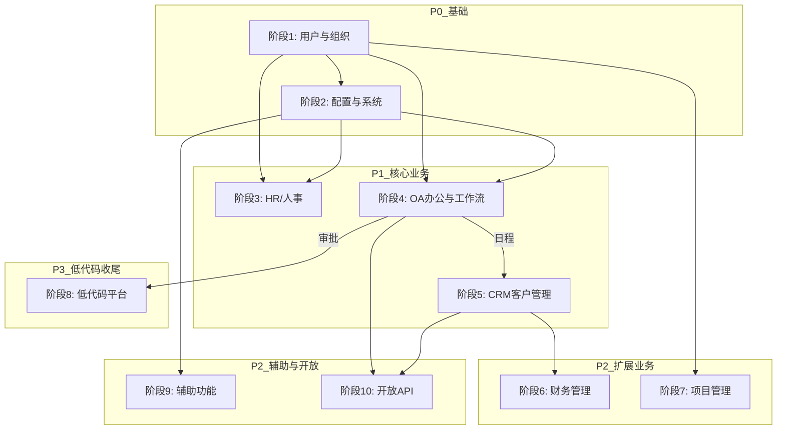

# 陀螺匠 OA 迁移主计划：PHP Laravel 9 → Java 17 + Spring Boot 3

> **版本**: 2.0  
> **创建日期**: 2026-03-30  
> **重构日期**: 2026-04-06  
> **目标**: 功能对齐，不新增能力；前端 Vue2 保持不变；本文件为主计划索引，详细接口清单见各阶段子计划。

---

## 一、项目背景

### 1.1 源系统 (PHP)

- **框架**: Laravel 9 + Swoole (LaravelS) + JWT + Casbin
- **控制器**: ~129 个 (`app/Http/Controller/AdminApi/`)
- **服务层**: ~200+ Service + Dao
- **数据库**: MySQL，~219 张 `eb_` 前缀表
- **API 前缀**: `/api/ent/*` (Spatie 路由属性注册)
- **前端**: Vue 2.6 + Element UI 2.15，基地址 `{origin}/api/ent`

### 1.2 目标系统 (Java) — Bubble-Cloud

- **框架**: Java 17 + Spring Boot 3.5.9 + Spring Cloud 2025.0.1 + Spring Cloud Alibaba 2025.0.0.0
- **ORM**: MyBatis-Plus 3.5.16
- **认证**: Spring Authorization Server + OAuth2（OA 模块通过 `OaPhpJwtTokenService` 桥接 PHP JWT）
- **网关**: Spring Cloud Gateway (8666)
- **注册/配置中心**: Nacos

### 1.3 技术映射

| PHP 技术 | Java 替代 |
|----------|----------|
| Laravel 9 | Spring Boot 3.5.9 |
| JWT (tymon) | OaPhpJwtTokenService 桥接 |
| Casbin RBAC | Spring Security + `@HasPermission` |
| Swoole/LaravelS | Undertow + WebSocket |
| Eloquent ORM | MyBatis-Plus 3.5.16 |
| Redis | Spring Data Redis |
| 队列 Jobs | Spring Quartz |
| OSS/COS/七牛 | common-oss (S3 兼容) |
| Spatie 路由属性 | `@RequestMapping` / `@GetMapping` 等 |

---

## 二、核心原则

1. **功能对齐不新增** — 只复刻 PHP 已有能力
2. **前端不动** — Vue2 + Element UI 保持原样，API 路径和响应格式完全兼容
3. **数据库不迁移** — 直连同一 MySQL 实例，实体用 `@TableName("eb_xxx")` 映射
4. **响应格式兼容** — OA 接口使用 `R.phpOk`/`R.phpFailed`（与 PHP `status`/`msg`/`data` 对齐）
5. **禁止占位桩** — 每阶段实施的接口必须实现真实业务逻辑，不允许 `SimplePageVO.empty`
6. **验收第一原则** — 与 PHP 同路径、同参数、同响应结构对齐

---

## 三、当前代码状态基线 (2026-04-06)

| 模块 | 状态 | Controller / Endpoint |
|------|------|----------------------|
| bubble-gateway | 已完成 | 统一入口 |
| bubble-auth | 已完成 | 2C / ~4E |
| bubble-biz-backend | 已完成 | 14C / 98E (RBAC/系统管理) |
| bubble-biz-agi | 已完成 | 14C / 84E (AI 智能体) |
| bubble-biz-oa | **迁移中** | 80C / ~300E (约 45% 真实逻辑，55% 占位桩或部分实现) |
| bubble-biz-flow | 未开始 | 仅启动类 + 内部接口桩 |
| bubble-visual | 已完成 | codegen/monitor/quartz |

### 3.1 已确认的占位桩（需在对应阶段消除）

| 控制器 | 占位类型 | 归属阶段 |
|--------|---------|---------|
| `AttendanceController` | 全量空列表/空成功 (12处) | 阶段四 |
| `ApproveApplyController` | 处理/表单/人员/催办等核心流转 (8处) | 阶段四 |
| `DailyController` | 下级人员/统计/提交列表等 (8处) | 阶段四 |
| `ReportController` | 全量空列表 | 阶段四 |
| `ScheduleController` | 分页桩 | 阶段四 |
| `BillController` | 统计图/分析/表单 (5处) | 阶段六 |
| `SystemStorageController` | 创建/配置/同步/域名表单 (4处) | 阶段二 |
| `SystemMenusController` | 保存菜单/未保存权限 (2处) | 阶段二 |
| `EnterpriseRoleController` | 超级角色权限 (2处) | 阶段二 |
| `UserCenterController` | 简历分页桩 | 阶段九 |
| `CloudFileWave7Controller` | 全量占位 | 阶段九 |
| `CloudSpaceWave7Controller` | 全量占位 | 阶段九 |
| `CrudModuleWave7Controller` | 全量占位 | 阶段八 |
| `OpenApiWave7StubController` | 全量占位 | 阶段十 |
| `UpgradeAdminController` | 协议/数据/升级占位 | 阶段二 |
| `CrmClientInvoiceController` | 在线开票 URI 占位 | 阶段五 |

---

## 四、十阶段总览与优先级

| 阶段 | 名称 | 优先级 | PHP 控制器数 | 预估工时 | 前置依赖 | 子计划文件 |
|------|------|--------|-------------|---------|---------|-----------|
| 1 | 核心用户与组织管理 | P0 | 18 | 2-3 周 | 无 | [phase-01](phase-01-user-org.md) |
| 2 | 配置中心与系统管理 | P0 | 17 | 1.5-2 周 | 阶段 1 | [phase-02](phase-02-system-config.md) |
| 3 | HR/人事管理 | P1 | 15 | 2-3 周 | 阶段 1, 2 | [phase-03](phase-03-hr.md) |
| 4 | OA 办公与工作流 | P1 | 16 | 3-4 周 | 阶段 1, 2 | [phase-04](phase-04-oa-workflow.md) |
| 5 | CRM 客户管理 | P1 | 16 | 3-4 周 | 阶段 1, 2, 4(日程) | [phase-05](phase-05-crm.md) |
| 6 | 财务管理 | P2 | 3 | 1-1.5 周 | 阶段 5 | [phase-06](phase-06-finance.md) |
| 7 | 项目管理 | P2 | 6 | 2 周 | 阶段 1 | [phase-07](phase-07-project.md) |
| 8 | 低代码平台 | P3 | 6 | 3-4 周 | 阶段 2, 4(审批)；**建议置于阶段 9、10 主体之后** | [phase-08](phase-08-lowcode.md) |
| 9 | 辅助功能模块 | P2 | 16 | 2-3 周 | 阶段 1, 2 | [phase-09](phase-09-auxiliary.md) |
| 10 | 开放 API | P2 | 10 | 1.5-2 周 | 阶段 1, 2, 4(日程), 5；**低代码数据开放子集依赖阶段 8** | [phase-10](phase-10-openapi.md) |
| **合计** | | | **~123** | **~22-30 周** | | |

---

## 五、全局依赖关系

### 5.1 关键依赖说明

| 依赖链路 | 说明 |
|---------|------|
| 阶段1 → 所有 | 登录/菜单/用户信息/组织架构是全局基础 |
| 阶段2 → 阶段3,4 | 角色权限、字典、附件存储被业务模块引用 |
| 阶段4(日程) → 阶段5 | CRM 客户提醒、跟进与日程联动 |
| 阶段4(审批) → 阶段8 | 低代码审批依赖审批基础流程 |
| 阶段5 → 阶段6 | 财务流水关联 CRM 合同/客户 |
| 阶段4(日程)+5 → 阶段10（主体） | 开放 API 中的日程、CRM 等不依赖低代码 |
| 阶段8 → 阶段10（子集） | `OpenModuleController` 低代码数据开放须动态 CRUD 已就绪 |

### 5.2 阶段 8～10 推荐实施顺序

低代码（阶段 8）复杂度高，**与优先级数字解耦后的建议执行顺序**为：

1. **阶段 9**（辅助功能）：仅依赖阶段 1、2，可与阶段 6、7 并行规划。
2. **阶段 10 主体**：Key/鉴权、CRM、发票、联系人、付款、日程等 —— 依赖阶段 4（日程）、5，**不等待阶段 8**。
3. **阶段 8**（低代码）：依赖阶段 2、4(审批)，在 9 与 10 主体推进后再集中攻坚。
4. **阶段 10 收尾**：`OpenModuleController`（低代码数据 Open API）在阶段 8 完成后实现并与全量开放 API 一并验收。

---

## 六、开发规范（强制）

> 详见 [`.cursor/rules/backend-conventions.mdc`](../../../.cursor/rules/backend-conventions.mdc)，此处摘录 OA 关键要点。

### 6.1 分层与命名

- **Service**: `XxxService extends UpService`、`XxxServiceImpl extends UpServiceImpl`
- **Mapper**: `XxxMapper extends UpMapper`，自定义 SQL 写 `XxxMapper.xml`，Mapper 接口禁止 `@Select`/`@Update`
- **Controller**: 禁止注入 Mapper、禁止 Controller 内 `Wrappers.lambdaQuery`（简单条件 `xxxService.list(Wrappers...)` 除外）

### 6.2 响应与兼容

- OA 接口统一 `R.phpOk` / `R.phpFailed`，勿与网关 `R.ok` 混用
- 与 PHP 同路径、同参数、同响应结构对齐

### 6.3 事务

- `ServiceImpl` 的 `create`/`update` 必须重写并 `@Transactional(rollbackFor = Exception.class)`

### 6.4 禁止项

- 禁止新增 `SimplePageVO.empty` 类占位桩
- 禁止业务层 `Map<String, Object>` 作入参/出参
- 禁止 `JdbcTemplate` 直查 OA 表

---

## 七、阶段内模块执行顺序规则

每个阶段内的模块按以下规则排序执行：

1. **依赖优先**: 被其他模块联查的能力（标签、提醒、附件、日程）先于主实体大列表
2. **横切先于垂直**: Common/附件/消息先于 CRM、档案导入
3. **同一前端页**: 按 PHP 调用顺序（先下拉选项，再保存主表）
4. **占位清零**: 每阶段结束扫描并消除所有 `SimplePageVO.empty` 与空列表桩

---

## 八、验收标准（每阶段通用）

1. PHP 与 Java 同路径抽样请求对比（路径、关键字段、HTTP 状态与 `data` 形状）
2. 列出本次变更的 `bubble-api-oa` DTO/VO/实体
3. 复杂 SQL 注明 `XxxMapper.xml` 与 PHP 原 Service/SQL 对照点
4. 该阶段范围内的所有占位桩已被真实业务逻辑替换
5. 前端对应页面可正常操作（登录→导航→CRUD→关联功能）

---

## 九、风险清单与缓解策略

| 风险 | 影响 | 缓解策略 |
|------|------|---------|
| 前端 API 响应格式不兼容 | 前端页面报错/白屏 | 严格使用 `R.phpOk`/`R.phpFailed`；每阶段做 API 对比测试 |
| 低代码平台复杂度超预期 | 阶段 8 工期超出 | 阶段 8 置后实施，避免阻塞 9/10；预留 buffer，先核心 CRUD 再高级功能 |
| 考勤算法逻辑复杂 | 打卡/加班/迟到计算错误 | 梳理 PHP Service 逻辑；编写单元测试覆盖边界 |
| JWT 兼容过渡期问题 | 新旧系统 Token 不互通 | 保持 `OaPhpJwtTokenService` 桥接；灰度期两套并存 |
| 数据库 `eb_` 表结构不匹配 | 实体映射出错 | 以 `mysql-schema.sql` 为基线建立数据字典 |
| Chat 在 OA 实现、后续再与 AGI 归并 | 未来或有一次迁移/收口成本 | 阶段 9 约定：Chat 全量在 `bubble-biz-oa` 落地，不等待 AGI；归并时单独方案，见 [phase-09-auxiliary](phase-09-auxiliary.md) §3.11 |
| 工作流引擎选型 | 审批流程不可用 | 先 PHP 等价直实现，再迁 Flowable/Camunda |

---

## 十、灰度切换方案

1. **网关层路由**: Gateway 按路径前缀灰度路由，逐模块从 PHP 切到 Java
2. **切换顺序**: 阶段 1→2 完成后先切用户/配置模块；再逐步切业务模块
3. **回滚策略**: Gateway 路由一键切回 PHP 后端
4. **监控**: 每次切换后对比 PHP/Java 接口的响应时间和错误率

---

## 变更记录

| 日期 | 版本 | 说明 |
|------|------|------|
| 2026-03-30 | 1.0 | 初始版本：基于 PHP 源码全量扫描生成 11 阶段详细计划 |
| 2026-04-04 | 1.0+v2 | 新增 v2 执行路线图：28 工作包、7 波次、依赖示意与代码勘误 |
| 2026-04-06 | 2.0 | 全面重构：拆分为主计划 + 10 个阶段子计划；消除占位规划；明确模块依赖和功能优先级 |
| 2026-04-06 | 2.0.1 | 阶段 9：Chat/AI 对话明确在 OA 内实现，与 AGI 解耦；后续统一归并另立专项 |
| 2026-04-06 | 2.0.2 | 阶段 8 低代码置后（P3）；阶段 9、10 提升为 P2；阶段 10 与阶段 8 改为分步依赖（OpenModule 待阶段 8） |
